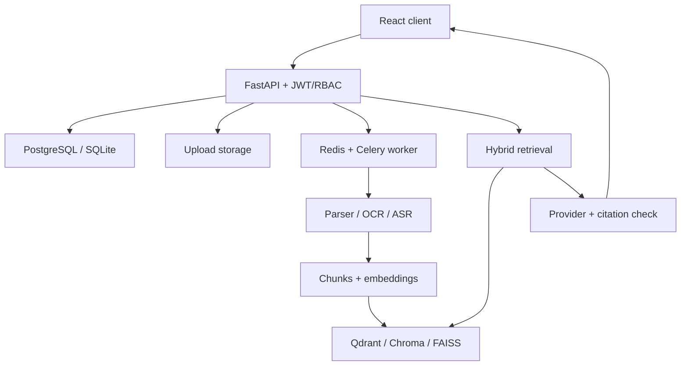

# Final-year project report

## Enterprise Multi-Modal Document Intelligence System Using Retrieval-Augmented Generation

**Project name:** Atlas Document Intelligence
**Discipline:** Computer Science and Engineering (Data Science)
**Repository:** `Yashovardhan47/AI-muti_model_rag`
**Report status:** Implementation report and evaluation protocol; empirical quality study remains to be conducted.

### Abstract

Organizations store knowledge in PDFs, Office files, tables, screenshots, images, recordings, videos, and operational logs. Conventional keyword search cannot consistently connect a question to source evidence across these formats. Atlas transforms each uploaded source into text with location metadata, optionally adds image captions and visual embeddings, and combines BM25 with vector retrieval. A selected cloud or local language model can synthesize an answer from retrieved excerpts; an extractive mode returns passages directly. The user sees citations and can open the original file. The prototype implements a web application, private per-user storage, authentication, background indexing, query history, search filters, exports, and administrative usage views. The supplied tests validate core workflows and isolation, while retrieval quality, robustness across modalities, and deployment-scale claims are reserved for a separate benchmark.

### 1. Introduction and motivation

An analyst may ask, “Which changes in the Q2 slide deck explain the incident described in Monday's log and the meeting recording?” Relevant evidence can live in slide text, chart labels, timestamped speech, and JSON fields. A useful system must ingest each medium, preserve where a statement came from, search across them, and avoid confident claims that lack support. Retrieval-augmented generation adds retrieved context to a language model, while multimodal preprocessing translates non-text evidence into searchable forms [1–4].

**Problem statement:** Design and implement an authenticated platform that answers evidence-seeking questions across heterogeneous user documents and lets the user trace every result to an accessible source location.

**Objectives:**
1. Support the named common enterprise file formats in a modular ingestion pipeline.
2. Index source-located chunks per tenant and combine lexical and semantic retrieval.
3. Provide answer generation, source citations, history, filters, and exports.
4. Verify privacy boundaries and essential flows with automated integration tests.
5. Define a reproducible research evaluation rather than assuming that citations guarantee correctness.

### 2. Scope and requirements

The accepted uploads are PDF, DOCX, PPTX, XLSX, CSV, TXT, LOG, JSON, JSONL, PNG, JPEG, WebP, MP3, WAV, M4A, MP4, and MOV. Images and scanned PDF pages use OCR; optional BLIP provides captions and CLIP adds image vectors. Audio uses Whisper through faster-whisper; video uses OpenCV frames and an FFmpeg audio track. JSON and CSV expose structured content; JSON log records also receive a simple robust numeric summary. This anomaly summary is a median/MAD heuristic and not a trained anomaly detector.

The web experience includes landing, registration, login, dashboard, upload center, chat with response stream, search, reports, and administration. Ordinary users own their files and conversations. Admins can see aggregate statistics and account metadata but have no source-file preview route for other users.

### 3. Literature and design rationale

Lewis et al. [1] motivate coupling parametric language models with retrieved nonparametric evidence. CLIP [2] supplies a shared image/text representation for optional visual retrieval. BLIP [3] can caption image content, complementing OCR text. Whisper [4] supplies speech transcripts for audio and video. The implementation keeps retrieval, parsing, vector storage, and generation behind local modules so one model or provider can be replaced without redesigning every API.

### 4. Architecture

Each file receives a UUID, owner ID, SHA-256 digest, status, media type, and storage path. Its chunks carry modality, ordinal, and page/slide/row/time location. An embedding reference links a chunk to text or optional image vector IDs and stores its vector to support FAISS per-user reconstruction. Chat sessions and messages preserve the answer and citations. Query logs, usage metrics, and audit events support dashboards and operational review. Alembic creates the schema; PostgreSQL is the concurrent option and SQLite supports demonstration.

### 5. Pipeline design

**Upload:** Stream input in 1 MiB blocks, enforce configured byte limit, check extension and selected file signatures, derive a per-user storage path, compute SHA-256, and avoid duplicates within a tenant. A background task or Celery worker marks the file `processing`, extracts segments, chunks and embeds them, writes the index, and sets `ready` or a visible `failed` state.

**Parsing:** PDF text comes from PyMuPDF with pdfplumber table extraction and a raster OCR fallback for sparse pages. Office libraries preserve paragraphs, slides, and tables. CSV/XLSX are partitioned in 30-row groups. OCR labels and optional captions make image/chart contents searchable. Whisper text retains time ranges; video frame text has timestamps. JSON logs preserve source values and add numeric summaries. Each transformation keeps a source pointer.

**Chunking:** Fixed windows use overlap; recursive splitting prioritizes paragraph boundaries; semantic splitting groups adjacent sentences by embedding similarity; document-aware splitting preserves short blocks. Tables are kept together to avoid separating a cell from its header. Long table blocks may exceed a conventional token budget; this is an evaluation and future refinement item.

**Retrieval:** BM25 ranks tokenized chunks. The selected text embedding model supplies query vectors; Qdrant/Chroma/FAISS ranks nearest chunks. Reciprocal-rank fusion combines lexical and vector ranks; an optional cross-encoder reranks candidate passages. Owner and selected file IDs are enforced during vector search and rechecked against SQL. Optional CLIP text-to-image search adds visual candidates. Metadata filters constrain files before retrieval.

**Answer:** A task-specific question and numbered excerpts are passed to the selected OpenAI, Anthropic, or Ollama model. A system instruction treats excerpts as untrusted data and asks for source-number citations. Extractive mode returns direct passages. Generated output is buffered for a per-claim audit of citation IDs and exact numerical values in cited excerpts. A failed draft is withheld in favor of direct passages. Citations retain source SHA-256 and history checks file availability; the UI labels removed or changed sources. This structural guard does not establish semantic entailment, so users must inspect important claims.

### 6. Implementation details

The backend uses FastAPI routers and Pydantic validation. Passwords use bcrypt. Access tokens expire after 30 minutes; refresh tokens expire after 14 days, are stored server-side by token identifier, and are revoked on rotation/logout. Role assignment is limited to an admin endpoint and public signup always receives `user`. Rate limiting uses Redis if configured, otherwise a per-process memory window. The browser keeps tokens in session storage for this prototype. A local task runs after response for simple demo use; Redis/Celery moves processing out of the API process and caches embedding vectors by model and text hash for seven days. Source previews require the same owner checks as delete and chat.

The frontend uses React Query for server data, Zustand for authentication state, Axios for ordinary requests, Fetch for SSE, and responsive layouts with light/dark themes. Search shows source locations and excerpts; chat includes an expandable evidence audit and prevents opening a citation whose source is no longer available. Deleting a file redacts assistant answers citing it and the deleted source's stored excerpt, including in exported chat history. User-written questions and session titles remain. The stream buffers provider text for checking before presenting delta events, increasing time to first answer. PDF, CSV, and JSON exports offer a simple summary, inventory, and conversation history.

### 7. Verification performed

The first focused integration suite runs against an isolated SQLite database and a local Qdrant directory. It checks registration, refresh rotation, logout, an admin boundary, file duplicate detection, per-user file and chat isolation, upload and index readiness, search, citations, stream events, log parsing, and deletion. The TypeScript/Vite production build succeeds. These checks establish a runnable baseline but do not measure information retrieval quality, parser accuracy on a diverse real corpus, or hardening under hostile uploads.

### 8. Evaluation plan and hypotheses

Create a de-identified dataset covering office documents, scanned pages, images/charts, audio/video, and structured logs. Annotators write answerable and unanswerable questions, evidence locations, atomic answer facts, and source-revision cases. Compare BM25, dense, hybrid, and hybrid-plus-reranking, then test the evidence audit and future version-aware provenance layer. Ablate OCR, captions/CLIP, chunk strategies, and top-k. Metrics: Recall@k, MRR, nDCG, human-judged citation precision/recall and fact support, abstention quality, stale-source detection, p50/p95 latency, storage, and cost. The included JSONL harness reports retrieval recall, MRR, and optional abstention by modality; other metrics need human labels or additional instrumentation. Bootstrap query-level confidence intervals and report every modality separately. A defensible research hypothesis is that version-aware evidence integrity reduces unsupported or stale claims relative to an otherwise equal retrieval pipeline, subject to measurement. No improvement is asserted yet. See [NOVELTY_ROADMAP.md](NOVELTY_ROADMAP.md).

### 9. Security, ethics, and limitations

Per-user isolation and source provenance are necessary but insufficient for regulated enterprise use. Uploaded files can be malicious; parsers need sandboxing, antivirus, timeouts, quotas, and patched dependencies. External model calls disclose retrieved source text to a provider; obtain user consent and retention controls. Browser-accessible refresh tokens are exposed to cross-site scripting. The current citation and number audit does not detect a plausible but false nonnumeric claim attached to a real source; exact-number matching can also refuse a valid calculation. OCR cannot always read handwriting or low-quality scans. Chart OCR/captioning cannot guarantee exact trend values. ASR can omit speakers or mishear terms. Local Qdrant and SQLite are not multi-worker configurations. Index and SQL writes lack a distributed atomic commit; reconcilers and backups are needed.

### 10. Conclusion and next work

Atlas delivers a coherent, testable multimodal RAG application with explicit provenance and tenant boundaries. The most valuable next work is a labeled evaluation set and error analysis, followed by ingestion sandboxing, semantic citation verification, index reconciliation, and measured multilingual/chart improvements. A research paper should be submitted only after running the controlled comparisons and writing actual results.

### References

[1] P. Lewis et al., “Retrieval-Augmented Generation for Knowledge-Intensive NLP Tasks,” NeurIPS, 2020. https://arxiv.org/abs/2005.11401
[2] A. Radford et al., “Learning Transferable Visual Models From Natural Language Supervision,” ICML, 2021. https://arxiv.org/abs/2103.00020
[3] J. Li et al., “BLIP: Bootstrapping Language-Image Pre-training for Unified Vision-Language Understanding and Generation,” ICML, 2022. https://arxiv.org/abs/2201.12086
[4] A. Radford et al., “Robust Speech Recognition via Large-Scale Weak Supervision,” 2022. https://arxiv.org/abs/2212.04356
